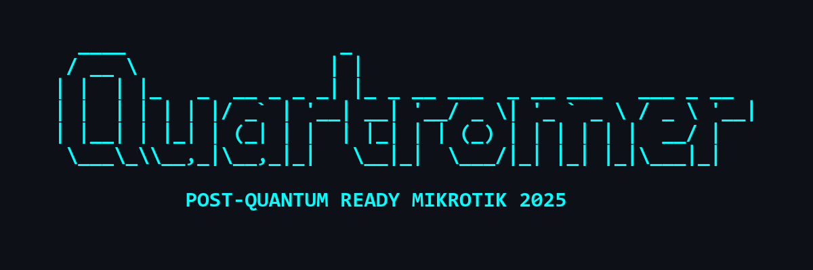

<div align="center">

<br>

<a href="https://github.com/M1rwana12">
  
</a>

<br><br>

[](https://github.com/M1rwana12/quantum-ready-mikrotik)

# quantum-ready-mikrotik

**MikroTik + Post-Quantum Cryptography = Будущее уже здесь**  
**Защити свой роутер от квантовых атак — сегодня**

<br>

<a href="https://github.com/M1rwana12/quantum-ready-mikrotik/stargazers">
  
</a>
<a href="https://github.com/M1rwana12/quantum-ready-mikrotik/watchers">
  
</a>
<a href="https://github.com/M1rwana12/quantum-ready-mikrotik/fork">
  
</a>

<br>

<a href="https://github.com/M1rwana12/quantum-ready-mikrotik/releases">
  
</a>
<a href="https://github.com/M1rwana12/quantum-ready-mikrotik">
  
</a>

<br><br>

</div>

---

## Зачем это нужно?

> **2025 год. Квантовые компьютеры уже ломают RSA и ECC.**  
> Злоумышленники **копируют твой трафик сегодня**, чтобы расшифровать его **завтра**.

**MikroTik — мощный, но уязвимый.**  
По умолчанию он использует **RSA, ECC, DH** — алгоритмы, которые **квантовые атаки уничтожат за часы**.

**`quantum-ready-mikrotik` — первый open-source toolkit**, который:
- **Аудитирует** уязвимые сертификаты
- **Генерирует** пост-квантовые ключи (Dilithium, Kyber)
- **Запускает** PQC TLS прокси
- **Автоматизирует** миграцию

**Ты защищаешь не только себя — ты защищаешь будущее.**

---

## Как это работает?

| Компонент | Что делает | Как использовать |
|---------|-----------|------------------|
| `check-pqc-readiness.rsc` | Сканирует роутер на RSA/ECC | `/system script run check-pqc` |
| `cert-gen-pqc.sh` | Создаёт **Dilithium** сертификаты | `./cert-gen-pqc.sh` |
| `openssl-pqc-proxy.py` | TLS 1.3 с **ML-DSA** | `python3 openssl-pqc-proxy.py` |
| `docker-pqc-proxy/` | Готовый Docker-образ | `docker run -p 443:443 ...` |
| `ansible-playbook/` | Авто-развёртка на 100+ роутеров | `ansible-playbook pqc-migrate.yml` |

---

## Быстрый старт (5 минут)

```bash
# 1. Клонируй
git clone https://github.com/M1rwana12/quantum-ready-mikrotik.git
cd quantum-ready-mikrotik

# 2. Сгенерируй PQC-сертификат
./scripts/cert-gen-pqc.sh

# 3. Запусти прокси
python3 scripts/openssl-pqc-proxy.py

# 4. Проверь роутер
# (загрузи check-pqc-readiness.rsc в WinBox)
/system script run check-pqc
```

---

## Что ты получишь?

| До | После |
|----|-------|
| RSA/ECC — уязвимо | **Dilithium + Kyber** — квантово-устойчиво |
| Ручная настройка | **Автоматизация** через Ansible |
| Нет аудита | **Авто-сканирование** уязвимостей |
| Нет прокси | **PQC TLS** для всех сервисов |

**Ты сэкономишь часы, а твоя сеть будет готова к 2030.**

---

## Дорожная карта

| Этап | Статус | План |
|------|--------|------|
| PQC VPN (Kyber) | Done | v1.0 |
| PQC SSH (Dilithium) | In Progress | v1.1 |
| Web Dashboard | Planned | v2.0 |
| Auto-migration | Planned | Q4 2025 |

---

## Структура проекта

```
quantum-ready-mikrotik/
├── docs/                  # Теория, гайды, roadmap
├── scripts/               # .rsc, .sh, .py — всё рабочее
├── tools/                 # Docker, Ansible
├── examples/              # Готовые конфиги
├── assets/                # Баннер, мемы
└── .github/workflows/     # Авто-релиз
```

---

<div align="center">

<br>

**Когда ты уже PQC-ready, а коллеги всё на RSA...**


<br><br>

**Star, если ты за квантово-устойчивое будущее!**

<br>

<sub>Made with quantum-resistant love by <a href="https://github.com/M1rwana12">@M1rwana12</a> • 2025</sub>

</div>

---

## Лицензия

[MIT License](LICENSE) — бери, улучшай, распространяй.
```